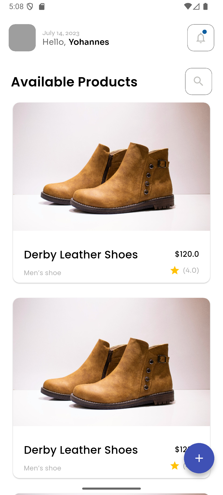
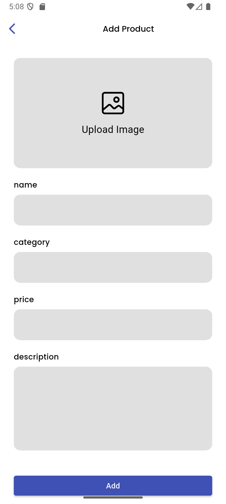

# 🛒 basic_ecommerce

An example Flutter e-commerce application built with Flutter.

---

## ✨ Features

- 🏠 Home page displaying a list of products
- 📄 Product details page
- 🔍 Search products
- ➕ Add new product

---

## 📁 Project Structure

- `lib/main.dart`: App entry point and route setup
- `lib/model/`: Product model and product manager
- `lib/constants/colors.dart`: Custom color definitions
- `lib/views/pages/`: App pages (home, details, search, add)
- `lib/views/widgets/`: Reusable UI widgets (product card, price slider, etc.)

---

## 🛍️ Product Model

Each product has:
- `id`, `title`, `description`, `price`, `rating`, `imageUrl`, `details`, `sizes`

---

## ⚡ Getting Started

### 1️⃣ Prerequisites

- Make sure you have [Flutter](https://docs.flutter.dev/get-started/install) installed (latest stable recommended).
- A device or emulator to run the app (Android/iOS/Web).

### 2️⃣ Setup

Clone this repository:

```sh
git clone https://github.com/ayanasamuel8/2025-project-phase-mobile-tasks
cd 2025-project-phase-mobile-tasks/on-boarding/basic_ecommerce
```

Get dependencies:

```sh
flutter pub get
```

### 3️⃣ Run the App

To run on a device or emulator:

```sh
flutter run
```

To run for web:

```sh
flutter run -d chrome
```

---

⚠️ Important Notes & Warnings
🖼️ Image Handling: The app uses a dual-system for images, which is critical to understand:
1. Bundled Assets: Initial dummy data uses local, read-only images bundled with the app (e.g., from the images/ folder). These are loaded using Image.asset().
2. Device Files: When you add or update a product with a new image, the app saves it to the device's private storage. These images are loaded using Image.file() with an absolute path.
💥 Image Persistence Warning: User-uploaded images are stored directly on the device.
Clearing the app's cache/data or uninstalling the app will PERMANENTLY DELETE these images. The file paths saved in the product data will become invalid, and the images will appear broken.
🌐 Web & Cross-Platform Limitations:
The Image.file() method will not work on Flutter Web, as a web browser cannot access a device's local file system. User-uploaded images will be broken on the web version.
For full cross-platform support, images would need to be uploaded to a cloud service (like Firebase Storage or an S3 bucket) and loaded via network URLs.
🏷️ Data Persistence: Product data (titles, prices, etc.) is managed in-memory and is not persisted. Restarting the app will reset all data to the initial dummy state.
🧪 This project is for learning and demonstration purposes. It is not production-ready.

---

## 🖼️ Screenshots

> 🏠 Home page:


> 📄 Details page:


> ➕ Add product page:


> 🔍 Search page:

>📍Filter page:

>🆕Update page:


---

## 📄 License

MIT
