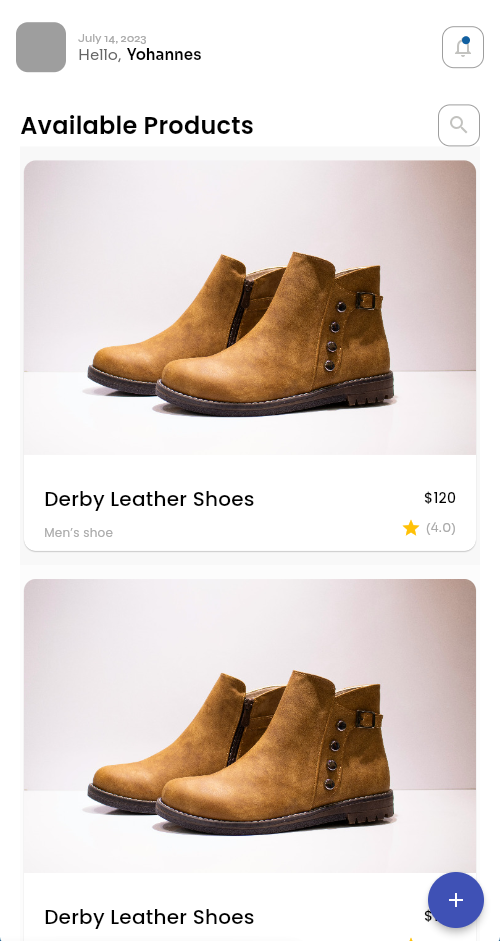
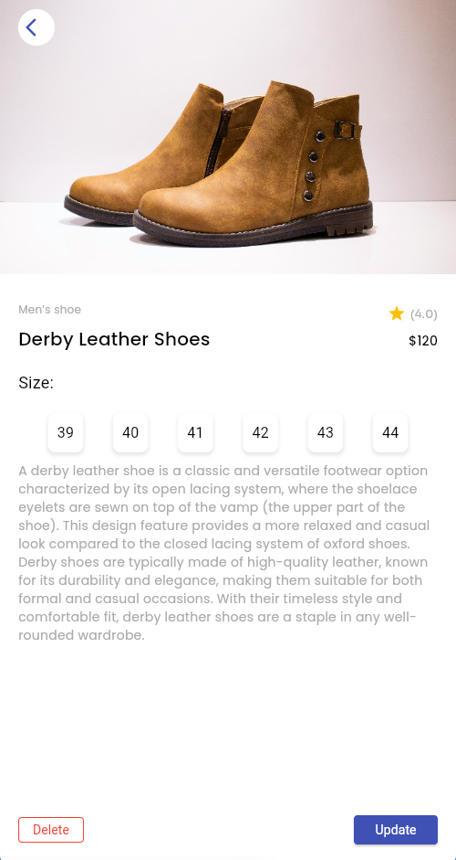
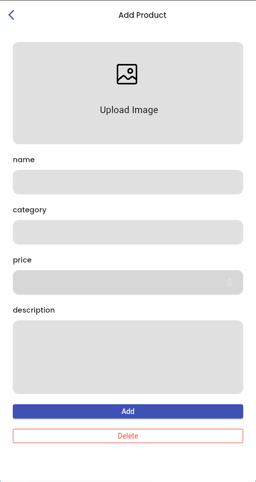
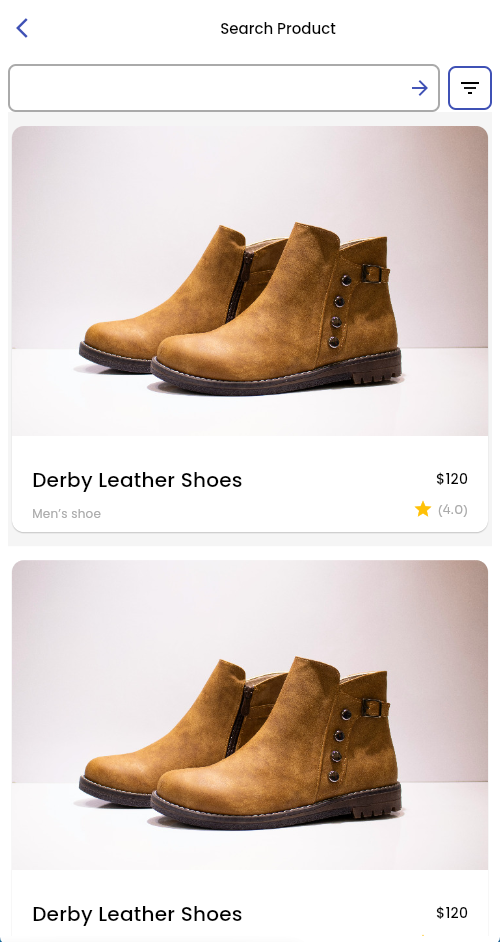

# basic_ecommerce

An example Flutter e-commerce application.

## Features

- Home page displaying a list of products
- Product details page
- Search products
- Add new product

## Project Structure

- `lib/main.dart`: App entry point and route setup
- `lib/model/`: Product model and product manager
- `lib/constants/colors.dart`: Custom color definitions
- `lib/views/pages/`: App pages (home, details, search, add)
- `lib/views/widgets/`: Reusable UI widgets (product card, price slider, etc.)

## Product Model

Each product has:
- id, title, description, price, rating, imageUrl, details, sizes

## Getting Started

1. Ensure you have Flutter installed: https://docs.flutter.dev/get-started/install
2. Run `flutter pub get` to fetch dependencies
3. Run the app: `flutter run`

## Screenshots

> Home page:

> Details page:

> Add product page:

> Search page:

## License

MIT
